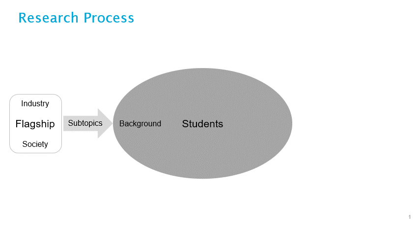

```{figure} ../images/Week_1.jpg
:name: week2_1image
```

# Week 2.1: The Research Ecosystem

In this quarter, we will journey through the implicit skills and knowledge that scientists need to safely and successfully carry a research project in almost any scientific setting. We will tackle the fundamental topics including but not limited to lab safety, budgeting, data management, making mistakes. We will take a reflective approach to the topics—how do we do them? Why do we do them? And what can we be doing better? Not all of these topics will be used in every student group project, but all scientists should be aware of them and consider them when making research-related decisions.   

This quarter will also be when students learn to turn their ideas and questions into methods and answers.  



This week is the first week of “quarter 2” and will thus include a lot of “Getting Started”.    You will have a greater focus on creating something new (new results, policy, algorithms, methods) than in “quarter 1”. This week’s schedule includes:  

*Monday:*
-	<a href=#introduction> Welcoming Words </a>
-   <a href=#team-reflection-activity>Team reflection activity</a>
-	<a href=#research-group-roles-panel-discussion> Research Group Roles Panel Discussion </a>

*Tuesday:*
-	Workshop: <a href=#workshop-sustainability-in-the-lab>Sustainability in the Lab</a> 
-	Workshop: <a href=#workshop-from-proposal-to-plan>From Proposal to Plan</a>

*Wednesday:*
-	Workshop: <a href=#workshop-budgeting-in-a-lab> Budgeting in the lab</a>
-	Workshop: <a href=#workshop-drug-development-process> Drug development process</a>

*Thursday:*
-	Workshop: <a href=#workshop-lab-safety> Lab Safety
-	Workshop: <a href=#workshop-making-and-addressing-mistakes> Making and Addressing Mistakes </a>

*Friday:*
-	Symposium: new teams on the projects


## Introduction
Welcome to Q2! During this first session, we will provide an overview of the plan for Q2, including the structure, the assessments, and the expected learning goals.  

We will have a general discussion of this week's content and how it is relevant specifically to Q2 (Why are we doing this now as opposed to Q1? How does this quarter differ from Q1?) 

### Team reflection activity
This interactive session focuses on team dynamics. Starting with visualizing how your team operated in Q1, you will discuss what went well within your team and what could be improved. Furthermore, we will discuss changes in your teams composition (e.g., if new members have joined or former members have left ). You will be invited to reflect on and answer the following questions what are the potential effects of these changes, and do you need to redefine the team contracts?  
### Key concepts
- Team dynamics 
- Change management  
- Reflection for improvement 
### Relevant learning goals
- Collaboration 
- Research 
- Critical Thinking 

## Research Group Roles Panel Discussion
Collaborative research groups have certain roles within them. These roles can change and evolve as the project progresses. However, within a research lab, there is a whole set of very formal research roles, including PIs, postdocs, technicians, core resources, and lab managers. Understanding these roles, how they work together, their respective responsibilities, and what to expect when joining a new lab can greatly improve your effectiveness. We will have various professionals working in labs for our panel discussions, who will share their everyday work practices, struggles and joys with you.   
### Key concepts
- What are the different roles in a research group? 
- What are the strengths and weaknesses of this structure? 
- What are the assumptions?  
- What are the needs of the various group members? 
### Relevant learning goals
- Research Process
- Career planning

## Workshop: Sustainability in the Lab
Biological science projects often require energy and resource-intensive processes.  For example, plastic-made disposable tools could be required for sterility and precision machinery. Devices such as freezers, need to be running 24/7. Large and costly computations might be needed for data analysis. Etc.  More sustainable practices and options exist. As scientists, you need to consider sustainability tradeoffs when making decisions for your projects. In other words you should ask yourself the following questions What are the sustainability issues in your project? How can you mitigate these issues? And what are the risks and tradeoffs to carry your project successfully and sustainably?  
### Key concepts
- Sustainability
- Resource usage
### Relevant learning goals
- Process of science
- Ethics and reflection

## Workshop: From Proposal to Plan
This is a structured time for groups to work with their coaches on what they need to do to turn their research proposal into a plan which is likely to succeed. What are the pitfalls, what resources need to be identified and anything that has been forgotten. Activities will include setting up a timeline of how and when things need to be done in order to complete the project in the time allotted and what can be done in parallel. 

### Key Concepts 

- Time management
- Resource allocation
- Making teams 

### Relevant learning goals 

- Scientific planning
- Collaboration skills 


### Workshop: Budgeting in a lab
In the world of scientific research, budgeting is an essential skill that ensures the smooth operation and sustainability of your laboratory. This lecture is tailored to equip you with the knowledge and strategies necessary to effectively manage finances within the scientific setting. 

Successful research often hinges on prudent financial management. Budgeting in the lab involves allocating resources efficiently, prioritizing spending, and ensuring that the lab's financial health aligns with research goals. 

Throughout this workshop, we will explore the intricacies of laboratory budgeting. We will discuss how much research actually costs on a yearly basis, what is the price of a research paper and what you can do with a 1.5M grant. Who pays the salary of a researcher? What are the costs of chemicals? What are the costs of plasticware? Who pays for conferences that scientists attend?   

## Key concepts
-	 Budget: Understanding how to distribute your budget across research projects, personnel, equipment, and supplies is vital for achieving research goals efficiently.
-	Cost Control: Learning to monitor and manage ongoing expenses, identifying cost-saving opportunities, and avoiding financial pitfalls are essential skills for maintaining a balanced budget.
-	Financial Planning: Developing a clear financial plan that includes short-term and long-term financial goals will help labs secure funding, make informed financial decisions, and ensure sustainability.
## Relevant learning goals
- Budgeting as it applies to laboratory management, including the creation of a budget, revenue sources, etc. 

- Understanding how research budgets work. 


## Workshop: Drug Development Process
Not all projects have a drug development component, but if working in biomedical research, it’s important for a researcher to understand what the process is for new developments. This can help you develop that long term vision of how this might turn into something which could be used in treatment. It can be important in funding decisions, prioritizing research questions and approaches.  

It’s also just useful in society for people to understand how development happens, the time frame, costs and access. This workshop is done by a representative of a pharmaceutical company to include that perspective and partnership.  
### Key concepts
Research process of drug design
### Relevant learning goals 
Understanding process of different kinds of research

## Workshop: Lab Safety
Get to know lab / computer / research environment. 

For those unfamiliar with working in a lab environment, this workshop will go through basic lab safety, in part so that as a collaborator visiting a lab, you don’t do something dangerous or destructive. 
 
## Key concepts
Etiquette in a lab. 
 
## Relevant learning goals
Understanding a research lab environment


## Workshop: Making and Addressing Mistakes
No one likes making mistakes, but they are a fact of life. And spending some time thinking about how you make them and what you should do when you make them is an important skill in becoming a better scientist. Sometimes we can call mistakes just first attempts, and we try something else with minimal negative consequences. But sometimes they are mistakes or accidents that must be formally reported. Knowing which is which and what reporting mechanisms are in place is important in being an ethical scientist.   
### Key concepts
- Mistakes happen
- Developing self-understanding of your response to mistake making
- Things to think about when addressing them
- Knowing when they must be reported 
### Relevant learning goals
Mistakes are part of collaboration and skilled collaboration involves being skilled at addressing them.  

## Group activity of the week
This week groups will move quickly to adjust their groups and select their focus project. Students and coaches will discuss the projects and how best to allocate resources (students and supervisors) to ensure that all projects are successful. Multi-center collaboration if you will.  

With your team, make research plan and new or updated team contract. 


## Discussion Questions
- How does your new group contract differ from the one with your old group?

- Why do you think these differences are there?

- Is your role in this new group different from before? How?

- Which experiences from the past groupwork are you going to use to improve collaboration with your group?

- What are you excited about in this next stage of the project?  

- How will you work together?

- Group membership may have changed, either with students stopping participation or moving to other groups. How are you feeling about that? How will you adjust? 

## Weekly Submitted Assignments
### Group
Submit team name and project plan draft.

### Individual
What are your learning goals for the next 10 weeks? What skills do you hope to improve?

# References
